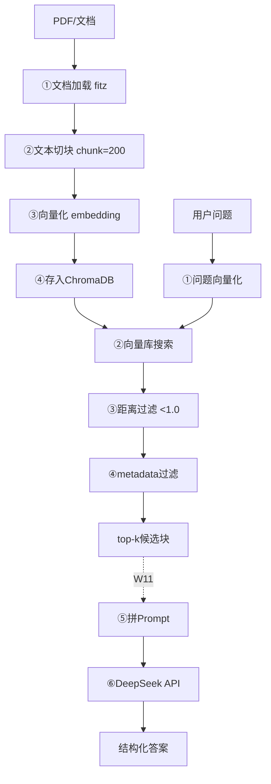

# W10-D7 RAG完整流程图

> D7 把 W10 一周学的「离线建库 + 在线检索」画成一张图。代码载体：w10_d7_rag_flowchart.py

## 一、知识整合（5 条核心）

1. **RAG 分两大阶段**：离线建库（文档→切块→向量化→存库）+ 在线检索（问题→embedding→top-k→拼Prompt）
2. **边界**：离线阶段完全不碰 LLM；在线阶段前半段（检索）也不碰 LLM，只有最后拼 Prompt 才进 LLM。W11 加的就是「检索→LLM 生成」这最后一段
3. **检索质量决定天花板**（呼应 D1/D6）：块烂 LLM 再强也答不对
4. **chunk_size 不是越大越好**：生产建议 500-1000，文档至少 5000+ 字
5. **W11 衔接点**：[D5+D6 检索] → top_k 块 → 拼 Prompt → DeepSeek API → 结构化答案

## 二、离线建库阶段

[PDF/Markdown/网页] → ①文档加载(fitz) → ②文本切块(chunk=200) → ③向量化(embedding) → ④存入ChromaDB
   documents / metadatas{来源,编号} / ids=chunk_0,chunk_1 → 持久化磁盘

## 三、在线检索阶段

用户问 → ①问题向量化 → ②向量库搜索(算L2距离,取top-k) → ③距离过滤(<1.0保留,>1.3丢弃)
       → ④metadata过滤(where条件) → 拼Prompt给LLM(W11)

## 四、W11 衔接

[D5+D6检索] → top_k块 → 拼Prompt(基于资料回答,禁止编造) → openai SDK v3.0.0 → DeepSeek API → 结构化答案

## 五、Mermaid 版（贴 mermaid.live 渲染）

## 六、复盘三问

1. **Q**：为什么 D7 不写新代码只画流程图？A：把零件拼成整机看全貌，画图比写码更适合总览
2. **Q**：哪段最影响质量？A：检索质量（在线阶段）决定天花板
3. **Q**：W11 和 W10 边界？A：W10 到「检索出 top-k 块」为止；W11 加 LLM 生成 + 出处引用

## 七、下一步

- **W11（明天 03:00）**：完整 RAG 问答系统 = 检索 + LLM 生成 + 带出处答案
- **真实数据**：朋友公司产品知识表 + 历史弹幕
- **周总文档** 10-Week10-向量库.md：保持占位，周日才汇总 D1-D7 + 复习清单
